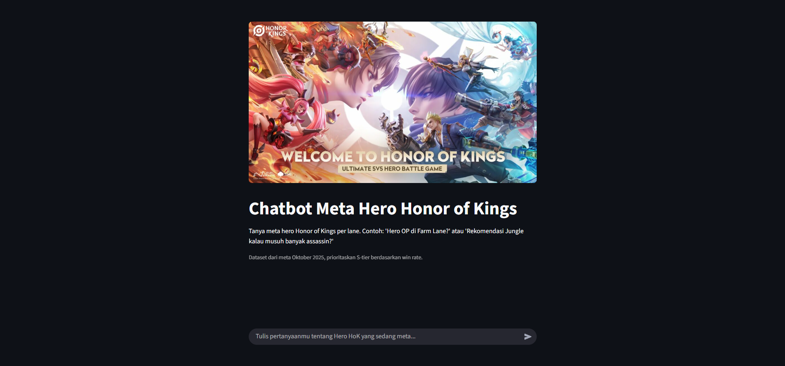
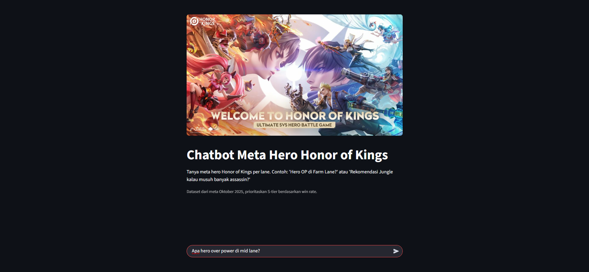
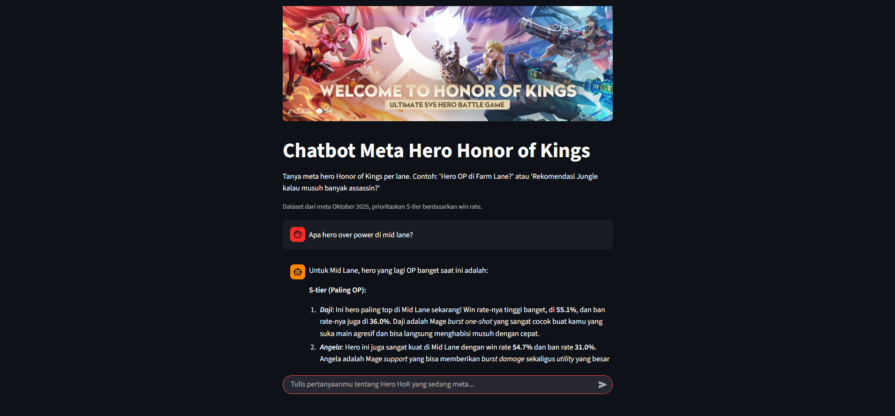

# Chatbot Meta Hero Honor of Kings

**Chatbot Meta Hero Honor of Kings**, sebuah aplikasi berbasis Streamlit yang menggunakan AI untuk memberikan rekomendasi meta hero berdasarkan data dari game MOBA Honor of Kings (HoK). Chatbot ini dirancang untuk membantu pemain menemukan hero OP (overpowered) per lane berdasarkan win rate, pick rate, dan ban rate, dengan fokus pada meta Oktober 2025.

## Getting Started

### Prerequisites
Pastikan Anda telah menginstal Python. Disarankan untuk menggunakan Miniconda atau Conda untuk environment management.

### Installation

#### Install Miniconda (if not already installed)
Download and install Miniconda from the official website:  
[https://docs.conda.io/en/latest/miniconda.html](https://docs.conda.io/en/latest/miniconda.html)

#### Create a Conda Environment
Buka terminal atau Anaconda Prompt Anda dan buat environment:
```bash
conda create -n chatbot-env python=3.9
conda activate chatbot-env
```

### Install Requirements
Arahkan ke direktori proyek dan instal paket yang diperlukan:
```bash
pip install -r requirements.txt
```
### Run the Streamlit Application
```bash
streamlit run chatbot.py

Aplikasi akan terbuka di web browser.
```

### Code Structure
* chatbot.py: File aplikasi Streamlit utama, yang berisi UI chatbot dan logika.
* requirements.txt: Menyusun semua ketergantungan Python yang diperlukan untuk proyek.
* hok_meta.db: Database dalam proyek ini menggunakan SQLite, yang merupakan database ringan berbasis file.

### Interface


### Input

Lakukan input pertanyaan terkait hero yang overpower atau yang sedang meta pada lane tertentu.

### Output

Hasil akan memberikan rekomendasi hero berdasarkan pertanyaan mengenai hero yang sedang meta.
